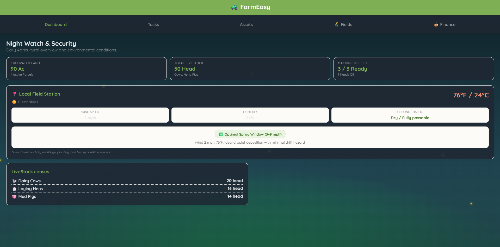

# FarmEasy 🚜

Hey! Welcome to **FarmEasy**. We built this because keeping track of crops, tractor oil changes, livestock feedings, and weather spray windows on a farm is usually a massive headache with paper clipboards and messy spreadsheets.

FarmEasy is a fast, simple, local-first farm dashboard that gets out of your way so you can focus on actual farm work. Everything runs right in your browser with zero setup.

---

## Screenshots 📸




---

## What it does:

* **Field Parcels & Crop Stages:** Track your acreage across wheat, corn, alfalfa, and orchards. Watch crops grow through 5 phenological stages from seeding to harvest, and log irrigation or fertilizer with one click.
* **Live Weather & Spray Advisor:** Pulls live local weather and calculates chemical drift hazard before you spray. Warns you if winds are too high (>14 mph) or if the ground is too muddy for heavy tractors.
* **Tractor Hours & Oil Service:** Log engine tach hours on your tractors and combines. Clean progress bars show you exactly when 250-hour oil and filter changes are due.
* **Grain Silo Spoilage Defense:** Keep an eye on grain moisture and core temp in the corn silo. Turn on the aeration fan with a click to dry down wet grain and prevent mold.
* **Daily Livestock & Barn:** Collect daily milk (+1 Gal), gather eggs (+6 Eggs), feed the pigs, and test the well pump pressure (42 PSI).
* **Chore Board & Finance Ledger:** Simple daily ito-do list sorted by morning/evening/urgent, plus a quick income and expense tracker for fuel and farm sales.
* **Day & Night Themes:** The app changes colors automatically based on the time of day (morning light, golden hour, night watch) with cute floating fireflies.

---

## How to use it:

You don't need to install Node, Docker, or mess with the terminal if you don't want to.

Just double-click `index.html` in your file explorer, and you're good to go!

If you want to run it from a local server instead:

```bash
python3 -m http.server 8000
```
Then open `http://localhost:8000` in your browser.

---

## AI USAGE

AI was used to make a shippable project that can be deployed on github pages

## License

MIT License — free to use and tweak however you like!
